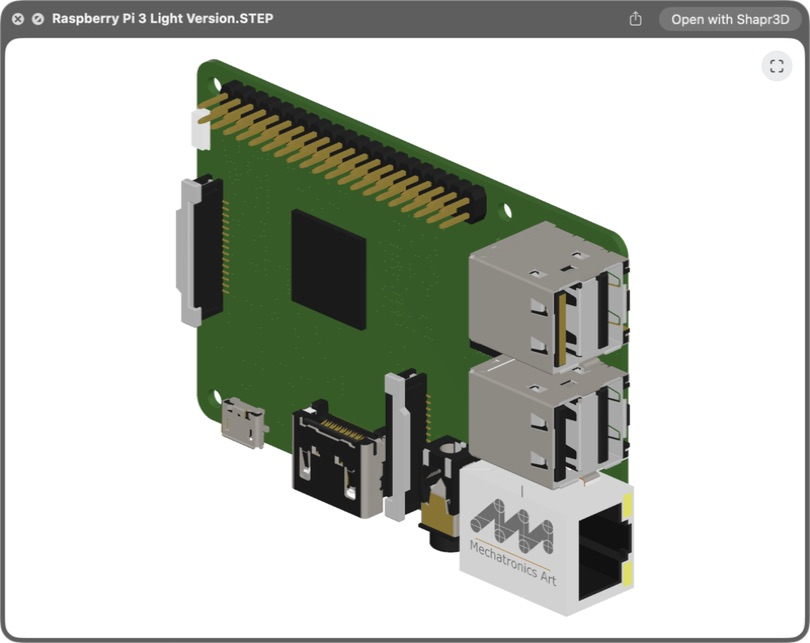
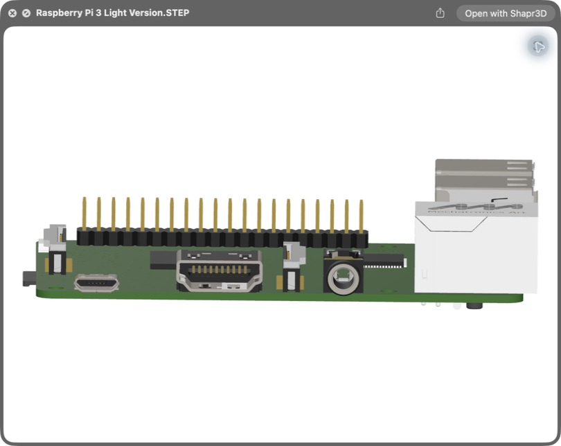

# LookSTEP

LookSTEP previews STEP files in Finder on macOS. Select a `.step` or `.stp`
file and press Spacebar to inspect it.



## Features

- Interactive Quick Look and Column View previews.
- Reads STEP face and part colors. When a file has no color data, separate
  parts receive distinct fallback colors.
- Adjusts tessellation by file size and part size to keep curved surfaces
  smooth without making previews unnecessarily heavy.
- Orbit and zoom with your mouse, just like in CAD. Shift-drag to pan, or use
  the Fit to Window button to reframe the model.
- Caches converted models for faster repeat previews.
- Limits import time and triangle count to protect Finder from difficult files.
- Processes files locally.

## Install

Requires an Apple Silicon Mac running macOS 15 or later, Xcode, and
[Homebrew](https://brew.sh/).

1. [Download LookSTEP](https://github.com/thesquiguy/LookSTEP/archive/refs/heads/main.zip)
   and open the ZIP file.
2. Open Terminal and type `cd `, including the space. Drag the unzipped
   `LookSTEP-main` folder into the Terminal window, then press Return.
3. Run:

   ```sh
   bash install.sh
   ```

The installer builds LookSTEP and installs it in `/Applications`. To install it
in your personal Applications folder instead, run `bash install.sh --user`.
See [BUILDING.md](BUILDING.md) for manual installation and troubleshooting.

## Use



1. Select a `.step` or `.stp` file in Finder.
2. Press Spacebar, or use Finder's Column View preview.
3. Left-drag to orbit, scroll or pinch to zoom, and Shift-left-drag to pan.

LookSTEP's small app is a diagnostic viewer. Finder Quick Look is the main
experience.

## How it works

[Open CASCADE Technology](https://dev.opencascade.org/) reads the STEP geometry
and colors, then converts the model into triangles. LookSTEP caches that mesh
and renders it with RealityKit inside Finder. Imports run in a separate service
with time and triangle limits.

LookSTEP is an early source release. Very large or unusual STEP files may be
slow or fail to preview.

## Measured preview times

Measured with LookSTEP 0.1.0 and OCCT 7.9.3 on an M1 MacBook Air with 8 GB of
memory. Times run from Quick Look invoking LookSTEP's preview extension to the
first presented geometry frame. Each uncached result uses a new file path;
successful cached results reopen that same file.

| Anonymous model | Size | Definitions / instances | Triangles | Uncached | Cached | Median uncached peak RSS |
| --- | ---: | ---: | ---: | ---: | ---: | ---: |
| Tiny single part | 0.22 MB | 1 / 1 | 9,316 | 0.55 s | 0.25 s | 180 MiB |
| Small colored electronics | 0.40 MB | 1 / 1 | 894 | 0.42 s | 0.26 s | 189 MiB |
| Medium instanced assembly | 6.9 MB | 33 / 93 | 419,736 | 7.18 s | 2.48 s | 284 MiB |
| Large complex shell | 25.7 MB | — | — | Timed out 3/3 at 15.29 s | — | 731 MiB |
| Large colored model | 35.5 MB | 1 / 1 | 145,250 (4 faces missing) | Opened 2/3 in 14.6–15.5 s; 1 timeout | 0.34 s | 1,030 MiB |
| Stress assembly | 61.8 MB | — | — | Timed out 3/3 at 15.31 s | — | 517 MiB |

Successful time values are medians of three trials. The large colored model
instead shows the range of its two successful uncached trials and the median of
its two successful cached trials; its third attempt timed out at 15.23 seconds
and produced no cache. Timeout values and combined peak RSS are medians of all
three uncached attempts. File size alone does not predict STEP complexity.

## Contributing

Read [CONTRIBUTING.md](CONTRIBUTING.md) before submitting a change. Do not post
confidential CAD files in public issues.

## License

LookSTEP is available under the [MIT License](LICENSE). Third-party licenses are
listed in [THIRD_PARTY.md](THIRD_PARTY.md).
